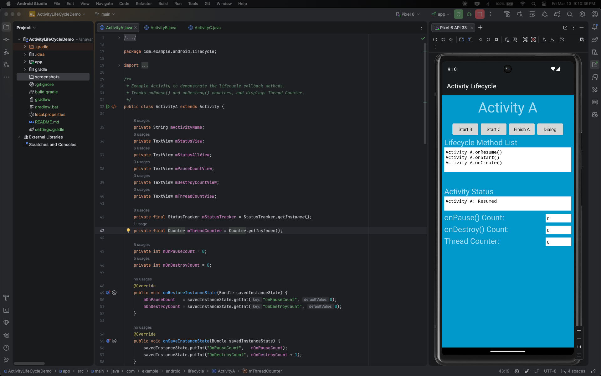
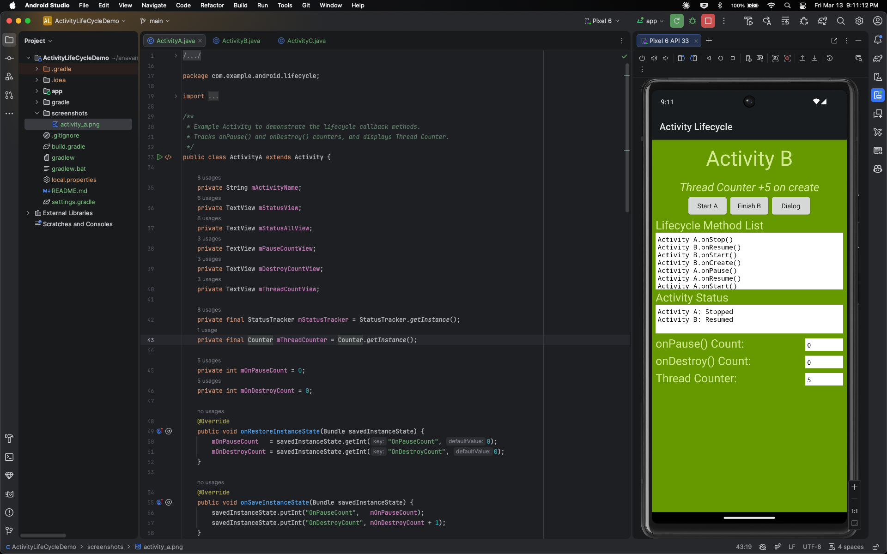
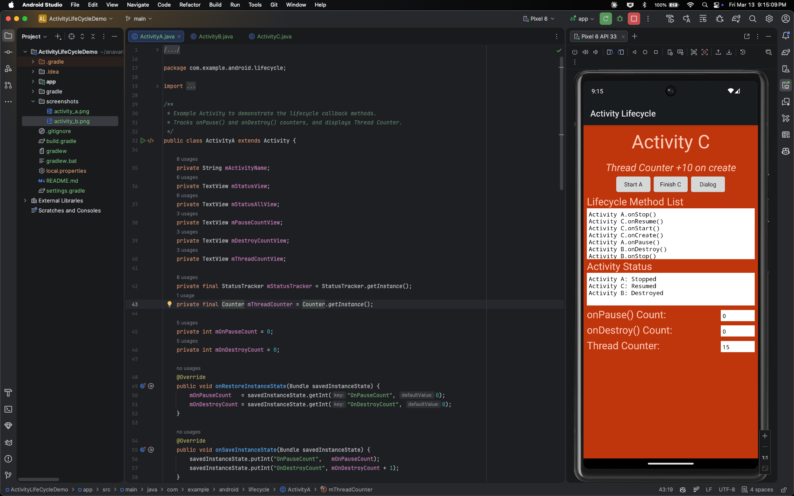
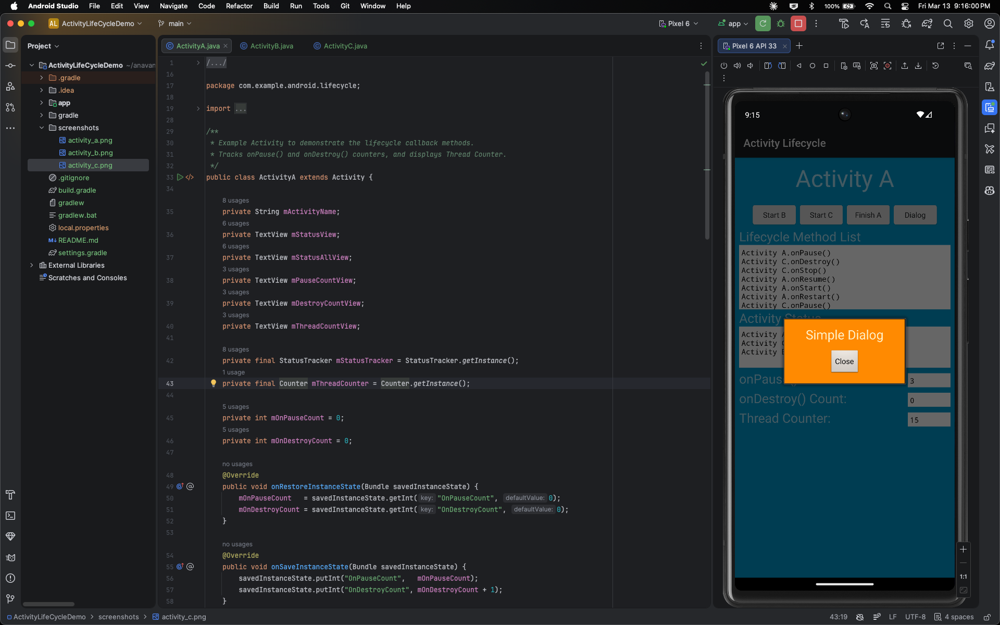
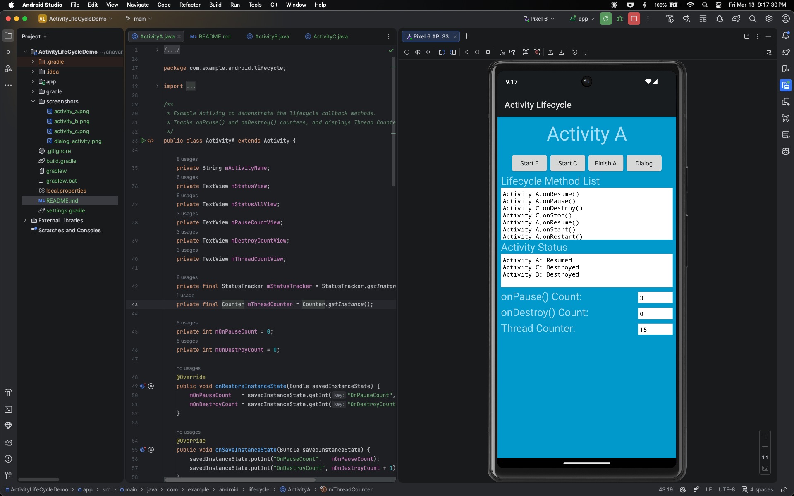
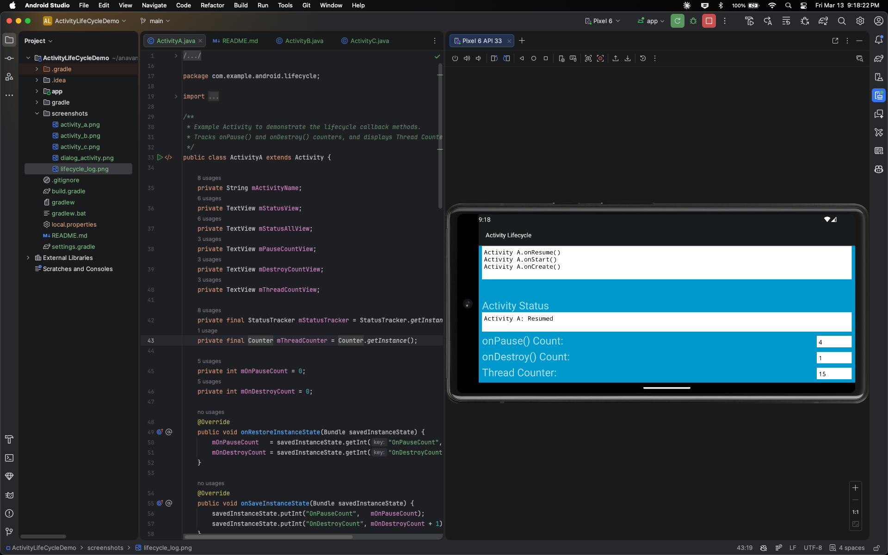

# Activity Lifecycle Demo

An Android application that demonstrates the Android Activity lifecycle by providing interactive, real-time visibility into lifecycle callback methods across multiple activities.

## Overview

This project is part of the CMPE 277 Smartphone App Dev course. It uses three activities (A, B, C) and a dialog overlay to show exactly when each lifecycle method fires, how state is preserved across navigation.

---

## Features

### Lifecycle Callback Tracking
Each activity overrides all seven lifecycle methods and updates the UI in real time:

| Callback | Triggered When |
|---|---|
| `onCreate()` | Activity is first created |
| `onStart()` | Activity becomes visible |
| `onRestart()` | Activity returns from stopped state |
| `onResume()` | Activity gains focus (interactive) |
| `onPause()` | Activity loses focus (partially visible) |
| `onStop()` | Activity is no longer visible |
| `onDestroy()` | Activity is being destroyed |

---

## Navigation Flow

```
ActivityA ──► ActivityB ──► ActivityA (back)
     │
     └──► ActivityC ──► ActivityA (back)
     │
     └──► DialogActivity (overlay, partial obscure)
```

ActivityB and ActivityC can also launch the Dialog overlay independently.

---

## Screenshots

### Activity A — Lifecycle State View
<!-- TODO: Add screenshot of Activity A showing lifecycle status and counters -->


### Activity B — Thread Counter (+5)
<!-- TODO: Add screenshot of Activity B showing the Thread Counter incremented by 5 -->


### Activity C — Thread Counter (+10)
<!-- TODO: Add screenshot of Activity C showing the Thread Counter incremented by 10 -->


### Dialog Overlay — Paused but Not Stopped
<!-- TODO: Add screenshot showing the dialog overlay with Activity A paused in the background -->


### Lifecycle Log — Full Event Sequence
<!-- TODO: Add screenshot of the status log showing the full sequence of lifecycle callbacks across activities -->


### Configuration Change — State Restored After Rotation
<!-- TODO: Add screenshot showing counters preserved after device rotation -->


---

## Key Classes

| Class            | Description                                                     |
|------------------|-----------------------------------------------------------------|
| `ActivityA`      | Entry point; can navigate to B, C, or the dialog                |
| `ActivityB`      | Increments global Thread Counter by 5 on creation               |
| `ActivityC`      | Increments global Thread Counter by 10 on creation              |
| `DialogActivity` | Floating dialog that partially obscures the parent activity     |
| `Counter`        | Process-scoped singleton tracking the cumulative thread counter |
| `StatusTracker`  | Process-scoped singleton recording the full lifecycle event log |
| `Utils`          | Helper for rendering the status log to `TextView`s              |

---

## Learning Outcomes

By running and experimenting with this app, you will be able to:

1. **Trace the full Activity lifecycle** — observe the exact order in which `onCreate → onStart → onResume → onPause → onStop → onDestroy` are called in response to user actions.

2. **Distinguish paused vs. stopped** — understand the difference between an activity being partially obscured (paused) by a dialog versus fully hidden by another activity (stopped).

3. **Understand back-stack behavior** — see how navigating between activities affects the lifecycle of both the outgoing and incoming activity.

4. **Preserve state across configuration changes** — verify that `onSaveInstanceState` / `onRestoreInstanceState` correctly restore counter values after screen rotation.

---

## Project Structure

```
app/src/main/
├── java/com/example/android/lifecycle/
│   ├── ActivityA.java
│   ├── ActivityB.java
│   ├── ActivityC.java
│   ├── DialogActivity.java
│   └── util/
│       ├── Counter.java
│       ├── StatusTracker.java
│       └── Utils.java
└── res/
    ├── layout/
    │   ├── activity_a.xml
    │   ├── activity_b.xml
    │   ├── activity_c.xml
    │   └── activity_dialog.xml
    └── values/
        ├── strings.xml
        ├── colors.xml
        └── dimensions.xml
```

---

## Course
**CMPE 277 — Smartphone App Dev**

San José State University

---

## Author
Akshay Navani