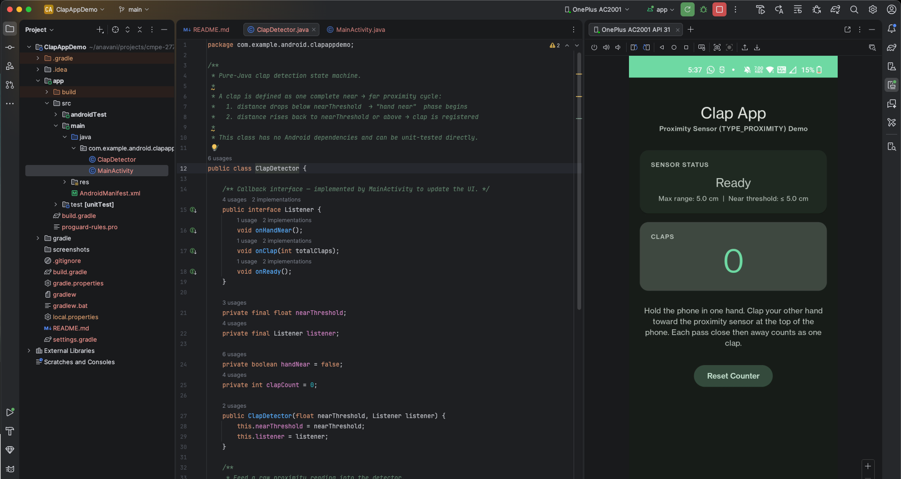
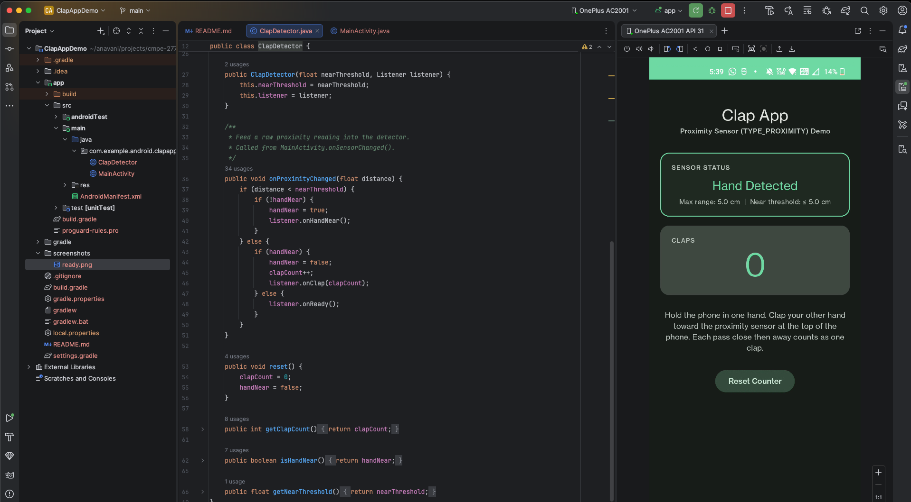
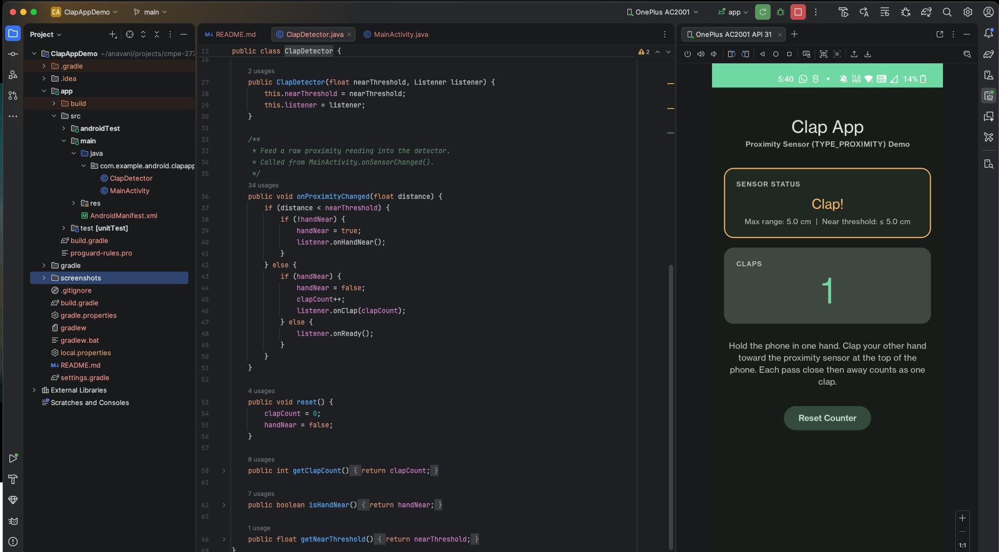
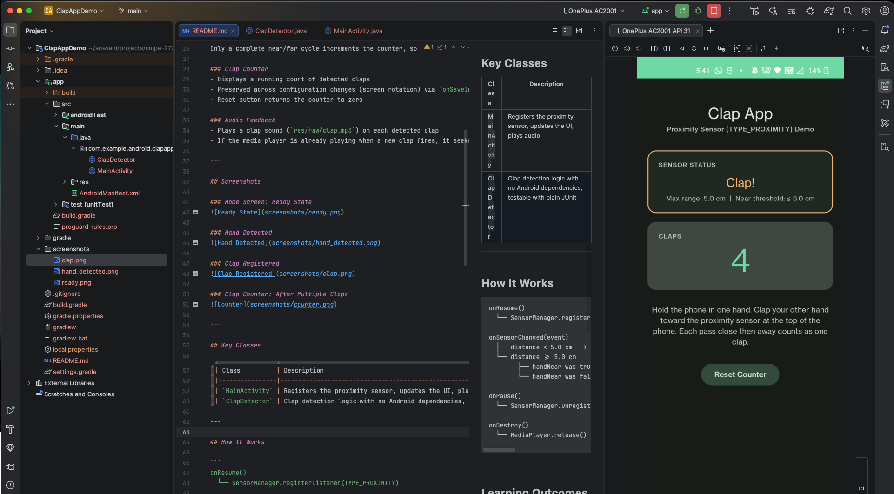

# Clap App Demo

An Android application that simulates clapping using the device's proximity sensor (`TYPE_PROXIMITY`). Hold the phone in one hand and clap your other hand toward the sensor; each pass triggers a clap sound and increments the counter.

## Overview

This project is part of the CMPE 277 Smartphone App Dev course. It demonstrates how to read hardware sensor data using the Android `SensorManager` API, specifically using the proximity sensor to detect when a hand moves close to and then away from the top of the phone, mimicking a clapping motion.

---

## Features

### Proximity Sensor Integration
- Registers `TYPE_PROXIMITY` sensor listener in `onResume()` and unregisters in `onPause()` for correct lifecycle management
- Detects near/far transitions using the sensor's reported distance value against a configurable threshold (5 cm)
- Displays sensor metadata at runtime (maximum range, near threshold)

### Clap Detection Logic
A single clap is detected as a two-phase gesture:

| Phase              | Sensor Value         | Action                                             |
|--------------------|----------------------|----------------------------------------------------|
| 1: Hand approaches | `distance < 5.0 cm`  | Status: "Hand Detected"                            |
| 2: Hand moves away | `distance >= 5.0 cm` | Status: "Clap!", counter incremented, sound played |

Only a complete near/far cycle increments the counter, so a hand that stays close does not keep firing.

### Clap Counter
- Displays a running count of detected claps
- Preserved across configuration changes (screen rotation) via `onSaveInstanceState`
- Reset button returns the counter to zero

### Audio Feedback
- Plays a clap sound (`res/raw/clap.mp3`) on each detected clap
- If the media player is already playing when a new clap fires, it seeks back to the start and replays

---

## Screenshots

### Home Screen: Ready State


### Hand Detected


### Clap Registered


### Clap Counter: After Multiple Claps


---

## Key Classes

| Class          | Description                                                                  |
|----------------|------------------------------------------------------------------------------|
| `MainActivity` | Registers the proximity sensor, updates the UI, plays audio                  |
| `ClapDetector` | Clap detection logic with no Android dependencies, testable with plain JUnit |

---

## How It Works

```
onResume()
  └── SensorManager.registerListener(TYPE_PROXIMITY)

onSensorChanged(event)
  ├── distance < 5.0 cm  ->  handNear = true   ->  status: "Hand Detected"
  └── distance >= 5.0 cm
        ├── handNear was true  ->  handNear = false, clapCount++, play sound, status: "Clap!"
        └── handNear was false ->  status: "Ready"

onPause()
  └── SensorManager.unregisterListener()

onDestroy()
  └── MediaPlayer.release()
```

---

## Learning Outcomes

By running and experimenting with this app, you will be able to:

1. **Access hardware sensors via SensorManager**: obtain a `Sensor` instance, register a `SensorEventListener`, and read raw values from `SensorEvent.values[]`.

2. **Manage sensor listeners with the Activity lifecycle**: understand why sensors must be registered in `onResume()` and unregistered in `onPause()` to avoid battery drain and stale callbacks.

3. **Implement gesture detection with a state machine**: see how a single boolean flag (`handNear`) turns a stream of raw proximity readings into discrete gesture events.

4. **Handle `TYPE_PROXIMITY` sensor specifics**: proximity sensors often report binary values (0 cm near, max range far) rather than continuous distances; the threshold logic works on both binary and analog sensors.

5. **Play audio with MediaPlayer**: use `MediaPlayer.create()` for one-shot audio playback and handle re-triggering while already playing.

6. **Preserve state across configuration changes**: use `onSaveInstanceState` to keep the clap counter intact through device rotation.

---

## UI

Built with Material Design 3 (`Theme.Material3.Dark.NoActionBar`):

- **Status card** (`Widget.Material3.CardView.Elevated`): shows the current sensor state; card stroke and text color update per state (no stroke when idle, green on hand detect, amber on clap)
- **Counter card** (`Widget.Material3.CardView.Filled`): displays the running clap total using the M3 `textAppearanceDisplayLarge` type scale
- **Reset button** (`Widget.Material3.Button.TonalButton`): M3 secondary action style
- Colors use the full M3 dark color role system (primary, surface, surfaceVariant, outline, etc.) based on a green seed color (`#52B788`)

---

## Project Structure

```
app/src/main/
├── java/com/example/android/clapappdemo/
│   ├── MainActivity.java
│   └── ClapDetector.java
└── res/
    ├── layout/
    │   └── activity_main.xml
    ├── raw/
    │   └── clap.mp3
    └── values/
        ├── strings.xml
        ├── colors.xml
        └── themes.xml

app/src/test/java/com/example/android/clapappdemo/
└── ClapDetectorTest.java
```

---

## Course
**CMPE 277: Smartphone App Dev**

San Jose State University

---

## Author
Akshay Navani
