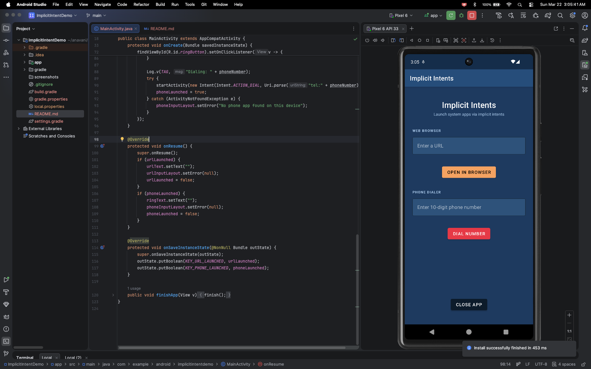
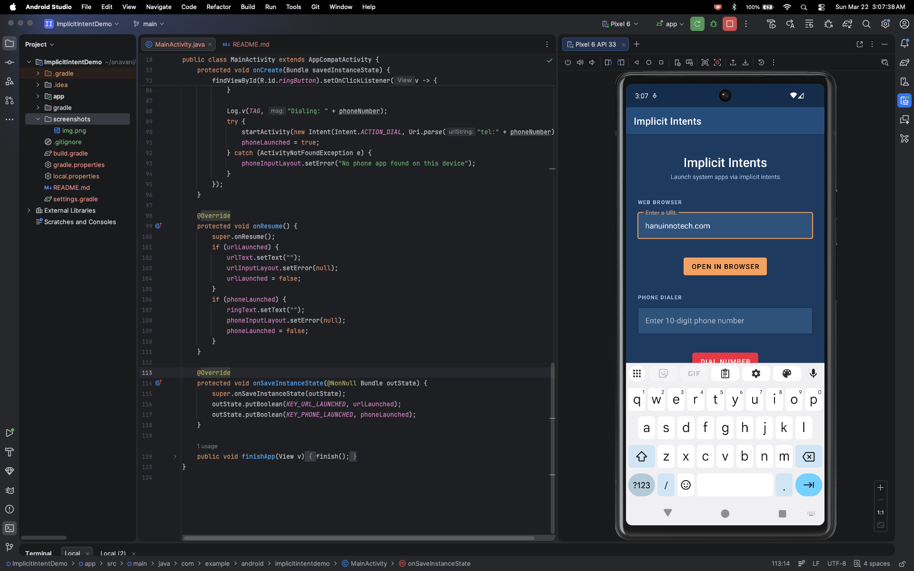
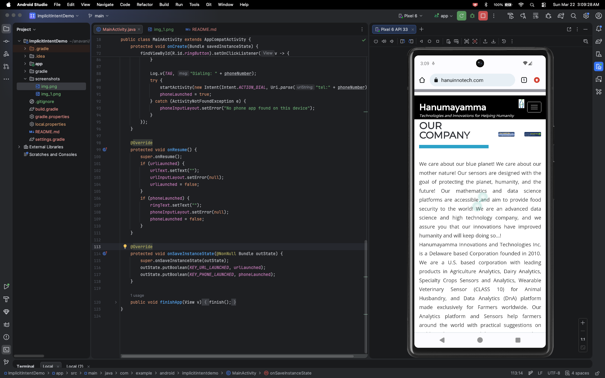
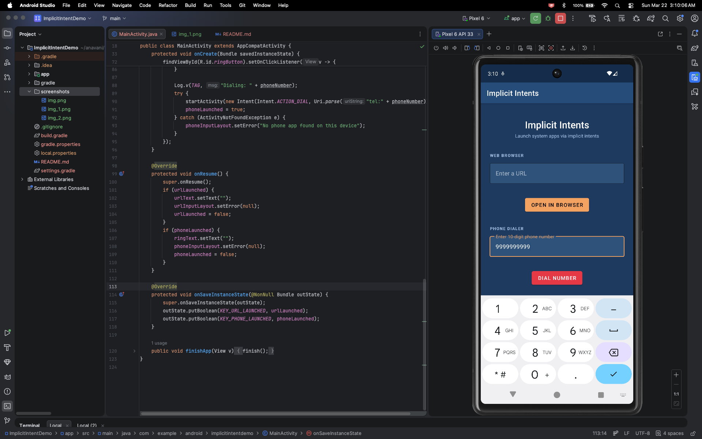
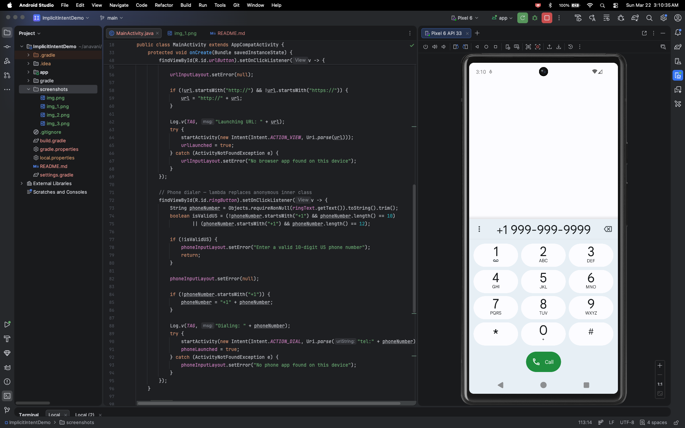
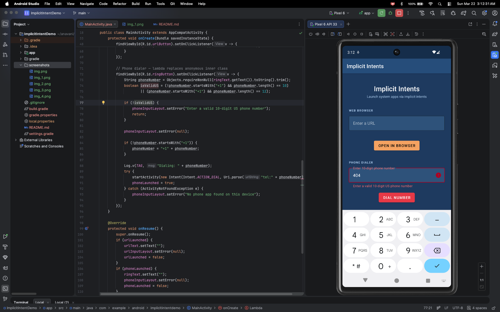

# Implicit Intent Demo

An Android application that demonstrates implicit intents by allowing users to launch the system web browser and phone dialer directly from the app.

## Overview

This is part of the CMPE 277 Smartphone App Dev course at SJSU. The app covers implicit intents, one of the more practical topics in Android dev. Instead of specifying an exact component to launch, the app describes an action and lets the Android system resolve the appropriate app at runtime.

---

## Features

| Intent       | Action        | Description                                                         |
|--------------|---------------|---------------------------------------------------------------------|
| Web Browser  | `ACTION_VIEW` | Opens a user-entered URL in the system default browser              |
| Phone Dialer | `ACTION_DIAL` | Opens the system dialer pre-filled with a validated US phone number |

Additional behaviours:
- Auto-prepends `http://` to URLs that don't specify a protocol
- Auto-prepends `+1` country code to 10-digit US phone numbers
- Inline field-level error messages via `TextInputLayout`
- Fields clear automatically when the user comes back from the browser or dialer, building on lifecycle concepts from the Activity Lifecycle assignment — `onResume()` and `onSaveInstanceState()` are used to track and persist the launch state across activity transitions

---

## Screenshots

### Home Screen



### Web Browser Launch




### Phone Dialer Launch




### Input Validation



---

## Key Classes

| Class          | Description                                                                         |
|----------------|-------------------------------------------------------------------------------------|
| `MainActivity` | Single activity; handles both web and phone implicit intents with inline validation |

---

## Learning Outcomes

By running and experimenting with this app, you will be able to:

1. **Understand implicit vs. explicit intents**: see how `ACTION_VIEW` and `ACTION_DIAL` let Android resolve the correct app without hardcoding a target component.

2. **Handle `ActivityNotFoundException`**: gracefully handle the case where no app on the device can respond to a given intent.

3. **Use `Uri.parse()`**: understand how URIs are used to pass structured data (URLs, `tel:` numbers) to other apps via intents.

4. **Apply Material Design input components**: use `TextInputLayout` with `OutlinedBox` style and floating hints for modern, accessible form design.

5. **Lifecycle-aware state management**: Building on top of the Activity Lifecycle assignment, `onResume()` and `onSaveInstanceState()` are used here in a practical context to reset UI state after returning from an external app.

---

## Project Structure

```
app/src/main/
├── java/com/example/android/implicitintentdemo/
│   └── MainActivity.java
└── res/
    ├── layout/
    │   └── activity_main.xml
    └── values/
        ├── strings.xml
        ├── colors.xml
        └── themes.xml
```

---

## Course
**CMPE 277 - Smartphone App Dev**

San José State University

---

## Author
Akshay Navani