# Interview Assistant Demo

An AI-powered interview preparation assistant that pairs a Python FastAPI backend (three specialized agents running on Groq's LLaMA 3.3 70B) with a native Android app (Kotlin, Jetpack Compose, Material3). The app guides candidates through mock interviews, study Q&A, spaced-repetition flashcard review, and progress tracking — with a persistent memory loop that improves coaching quality across sessions.

## Overview

This project is part of the CMPE 277 Smartphone App Dev course. It demonstrates an **agentic AI architecture**: the backend is not a single LLM call but a set of three specialized agents with distinct roles. The Android client maintains local memory (Room DB) that it feeds back to agents on every interaction, creating a self-improving coaching loop.

---

## Features

### Onboarding
One-time profile setup: name, target role (dropdown), experience level (Junior/Mid/Senior segmented buttons), target company, and interview date picker. Seeds demo data on first launch so all features look populated immediately.

### Home Dashboard
- Countdown hero card to interview date
- 3 stat chips: due flashcards, average score, total sessions
- Today's study plan
- 4 quick-action buttons for each major feature

### Mock Interview
A 4-phase flow powered by the Session Agent:

| Phase    | Description                                                                  |
|----------|------------------------------------------------------------------------------|
| Config   | Select role, level, and domain (algorithms, system-design, behavioral, etc.) |
| Starting | Builds coaching context from user history, generates opening question        |
| Active   | Chat-style interface with rubric scoring after each answer                   |
| Summary  | Overall score, strengths, weak spots, and next-focus recommendation          |

Rubric scores each answer on 4 dimensions: Clarity, Correctness, Communication, and Edge Cases. Domain constraints enforce STAR format for behavioral, architecture focus for system design, and algorithmic analysis for coding.

### Study
Three tabs powered by the Study Agent:

- **Ask**: Ask any technical question; the agent answers with personalized context and relevant flashcard history. Noteworthy Q&As are auto-saved as flashcards.
- **Generate**: Paste study notes and the agent produces 5–15 structured flashcards.
- **Daily FAQs**: Internet-sourced interview FAQs fetched daily via DuckDuckGo search across 3 query strategies (role-specific, site-targeted for Glassdoor/LeetCode/InterviewBit, experience-based), aggregated and synthesized by Groq. Expandable cards with source labels and save-as-flashcard action.

### Flashcards
- SM-2 spaced repetition algorithm (fully on-device)
- Card flip animation with 4 grade buttons: Again, Hard, Good, Easy
- Due Today / All Cards filter with Previous/Next navigation
- Session completion screen with review-again option

### Progress
- Confidence trend bar chart across sessions
- Topic breakdown with horizontal score bars
- Session history list with color-coded score badges

---

## AI Agents

### 1. Context Builder Agent
**Endpoint:** `POST /context/build`

Synthesizes a personalized coaching brief from the user's topic scores, episodic session memories, and study activity. This context is injected into all downstream agent prompts — the memory gateway that converts local Room DB data into actionable LLM context.

### 2. Session Agent
**Endpoints:** `POST /session/begin`, `/session/evaluate`, `/session/wrap`

Runs full mock interview sessions: generates questions, scores answers on a 4-dimension rubric, enforces domain-specific constraints, and produces a debrief with overall score and improvement recommendations.

### 3. Study Agent
**Endpoints:** `POST /study/ask`, `/study/generate`, `/study/daily-faq`

Handles Q&A with user context, converts notes into flashcards, and fetches internet-sourced daily FAQs via DuckDuckGo + Groq synthesis.

---

## Memory / Feedback Loop

```
Onboarding -> profile saved to Room
       |
MemoryBuilder reads Room -> POST /context/build -> context_summary
       |
POST /session/begin  -> first question
[answer loop] POST /session/evaluate -> rubric scores + next question
POST /session/wrap   -> debrief -> saved to Room as EpisodicMemory
       |
Next session: updated scores + memories re-enter /context/build
         -> coaching improves over time
```

Daily FAQ loop (async, background):
```
WorkManager fires daily (network required)
       |
DailyFaqWorker reads profile from Room
POST /study/daily-faq -> DuckDuckGo -> Groq -> 8 FAQs
       |
Saved to DailyFaqEntity -> push notification sent
       |
Study screen -> Daily FAQs tab -> expand -> save as flashcard
```

---

## Screenshots

### Onboarding
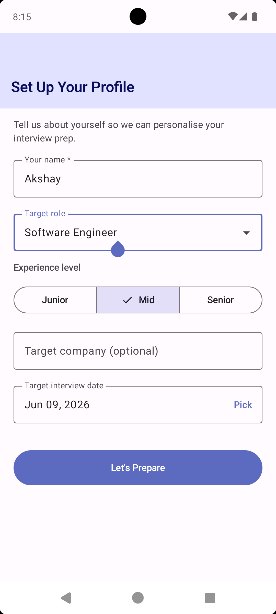
<!--  -->


### Home Dashboard
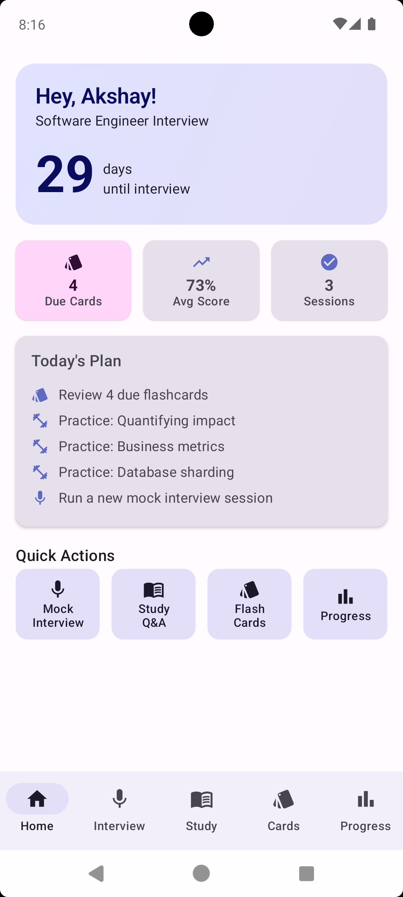
<!--  -->

### Mock Interview — Config
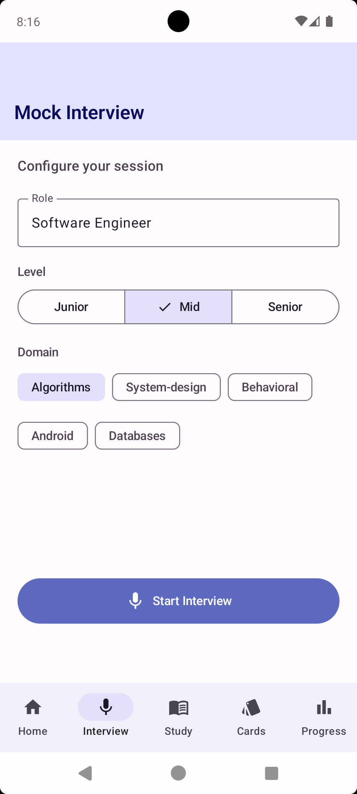

<!--  -->

### Mock Interview — Active Session
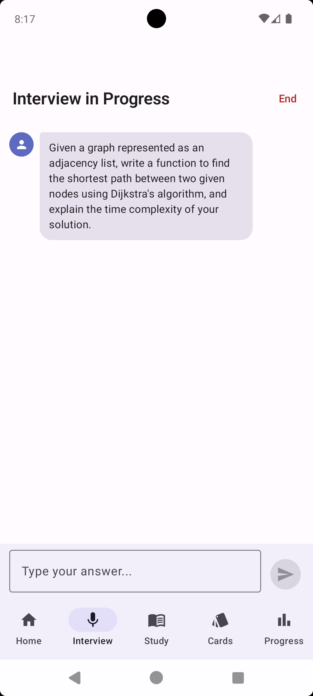
<!--  -->

### Mock Interview — Summary
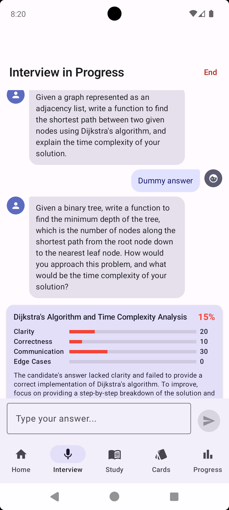
<!--  -->

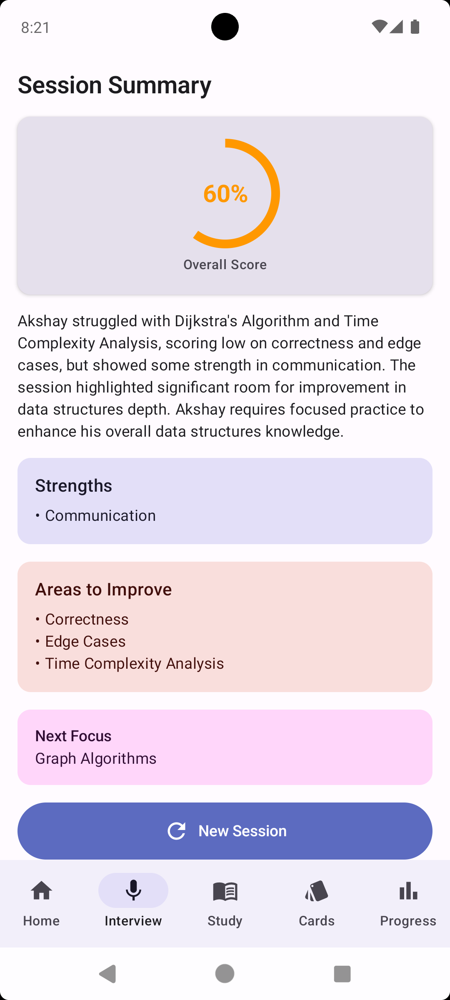
<!--  -->

### Study — Ask
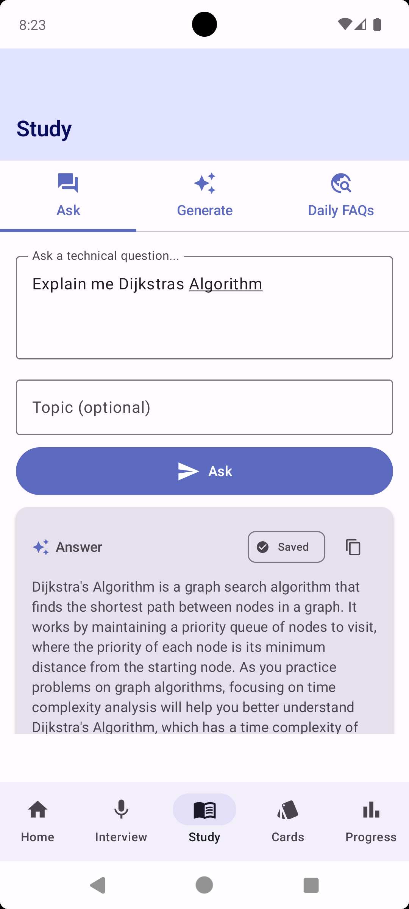
<!--  -->

### Study — Generate Flashcards
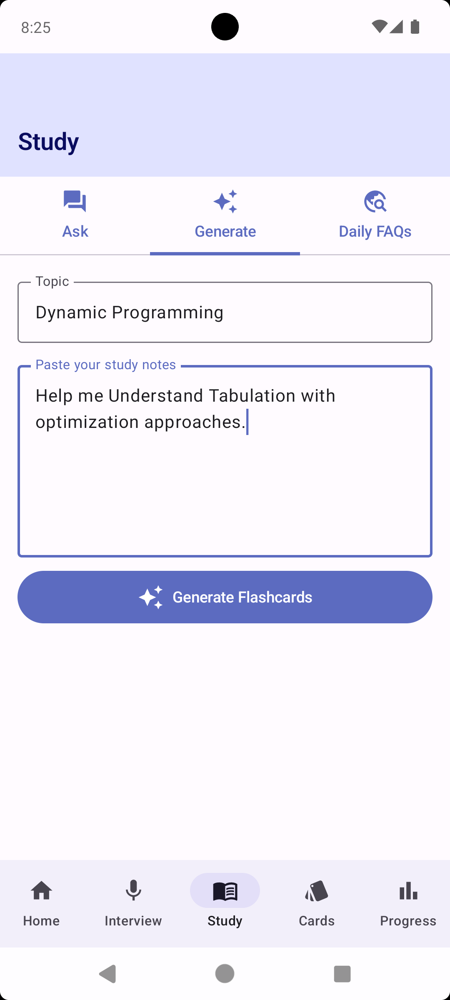
<!--  -->

### Flashcards — Review
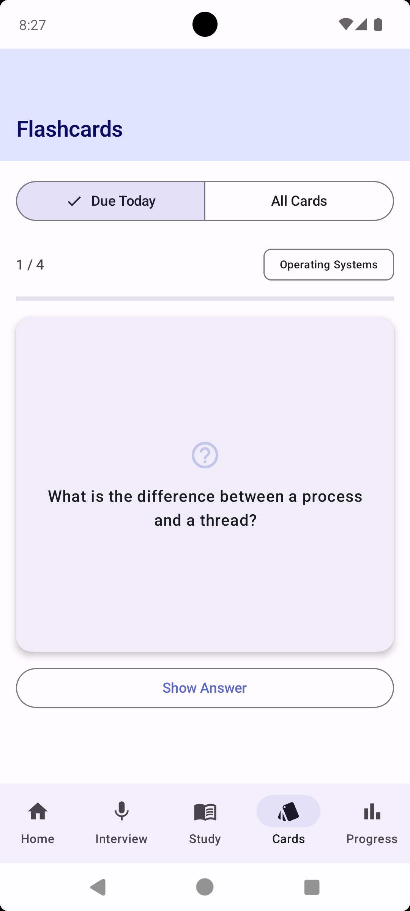
<!--  -->

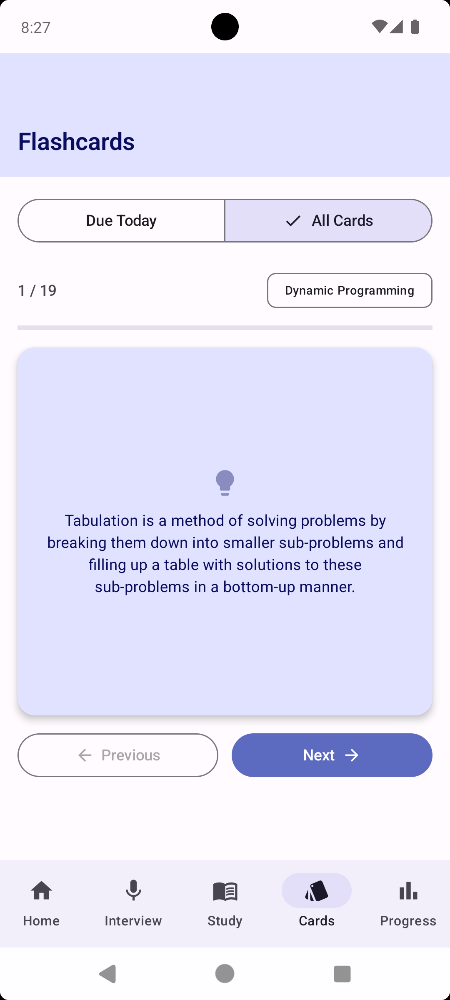
<!--  -->

### Study — Daily FAQs
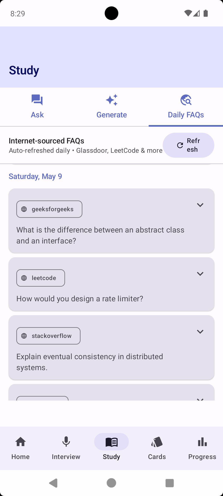
<!--  -->

### Progress
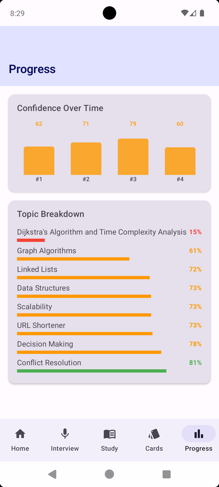
<!--  -->

---

## Setup

### Backend

```bash
cd InterviewAssistantDemo/backend
python -m venv .venv && source .venv/bin/activate
pip install -r requirements.txt
cp .env.example .env          # then set GROQ_API_KEY=gsk_...
uvicorn main:app --reload
# Verify: GET http://localhost:8000/health
```

### Android (Emulator)

No extra config needed — defaults to `http://10.0.2.2:8000/`.

```bash
cd InterviewAssistantDemo
./gradlew assembleDebug       # build only
./gradlew installDebug        # build + install to connected emulator
```

### Android (Physical Device via WiFi)

Add your machine's local IP to `local.properties`:

```properties
base.url=http://YOUR_LOCAL_IP:8000/
```

Start the backend bound to all interfaces:

```bash
uvicorn main:app --host 0.0.0.0 --reload
```

Ensure your phone and machine are on the same Wi-Fi network.

---

## Tech Stack

| Layer            | Choice                                       |
|------------------|----------------------------------------------|
| Language         | Kotlin 1.9.24                                |
| UI               | Jetpack Compose + Material3 (seed `#5C6BC0`) |
| Architecture     | MVVM + Repository (no DI framework)          |
| Local DB         | Room 2.6.1                                   |
| Networking       | Retrofit 2.11.0 + OkHttp 4.12.0 + Gson       |
| Async            | Kotlin Coroutines + StateFlow                |
| Background       | WorkManager 2.9.0                            |
| Charts           | Vico `compose-m3:1.15.0`                     |
| Min / Target SDK | 26 / 34                                      |
| Backend          | Python 3.9+, FastAPI 0.111.0, Uvicorn        |
| LLM              | Groq `llama-3.3-70b-versatile`               |
| Web Search       | `duckduckgo-search>=6.0`                     |

---

## Key Classes

| Class                 | Description                                                             |
|-----------------------|-------------------------------------------------------------------------|
| `MainActivity`        | Entry point, WorkManager scheduling, notification channel setup         |
| `AppRepository`       | Central facade; all API calls return `Result.Success` or `Result.Error` |
| `MemoryBuilder`       | Aggregates Room data into `/context/build` payload                      |
| `SpacedRepetition`    | SM-2 algorithm, fully local, no network                                 |
| `DemoDataSeeder`      | Seeds sessions, flashcards, and FAQs on first launch                    |
| `DailyFaqWorker`      | CoroutineWorker, fires daily via WorkManager                            |
| `InterviewViewModel`  | Drives the 4-phase mock interview flow                                  |
| `StudyViewModel`      | Manages Ask, Generate, and Daily FAQ tabs                               |
| `OnboardingViewModel` | Profile creation and demo data seeding                                  |

---

## Project Structure

```
InterviewAssistantDemo/
├── backend/
│   ├── main.py                     # FastAPI app, CORS, request logging
│   ├── requirements.txt
│   ├── agents/
│   │   ├── context_agent.py        # Coaching brief synthesis
│   │   ├── session_agent.py        # Mock interview (begin/evaluate/wrap)
│   │   └── study_agent.py          # Q&A, flashcard generation, daily FAQ
│   ├── models/
│   │   └── schemas.py              # Pydantic request/response models
│   └── routers/
│       ├── context.py              # POST /context/build
│       ├── session.py              # POST /session/begin, /evaluate, /wrap
│       └── study.py                # POST /study/ask, /generate, /daily-faq
│
└── app/src/main/java/com/example/android/interviewassistant/
    ├── MainActivity.kt
    ├── data/
    │   ├── local/
    │   │   ├── AppDatabase.kt      # Room DB v2, includes MIGRATION_1_2
    │   │   ├── entity/             # 7 Room entities
    │   │   └── dao/                # 5 DAOs
    │   └── remote/
    │       ├── ApiModels.kt        # Retrofit DTOs
    │       ├── ApiService.kt       # 8 endpoints
    │       └── RetrofitClient.kt   # OkHttp singleton, 60s timeouts
    ├── domain/
    │   ├── AppRepository.kt        # Central facade, Result<T> sealed class
    │   ├── MemoryBuilder.kt        # Room data -> context payload
    │   ├── SpacedRepetition.kt     # SM-2 algorithm
    │   └── DemoDataSeeder.kt       # First-launch demo data
    ├── ui/
    │   ├── AppNavigation.kt        # NavHost + BottomNavBar
    │   ├── theme/                  # Color, Type, Theme
    │   └── screens/
    │       ├── onboarding/         # Profile setup
    │       ├── home/               # Dashboard
    │       ├── interview/          # Mock interview (4 phases)
    │       ├── study/              # Ask / Generate / Daily FAQs
    │       ├── flashcards/         # SM-2 review queue
    │       └── progress/           # Charts + history
    └── workers/
        └── DailyFaqWorker.kt      # Daily background FAQ fetch
```

---

## API Endpoints

| Method | Path                | Agent   | Purpose                                              |
|--------|---------------------|---------|------------------------------------------------------|
| `POST` | `/context/build`    | Context | Build coaching brief from user history               |
| `POST` | `/session/begin`    | Session | Start interview, receive first question              |
| `POST` | `/session/evaluate` | Session | Submit answer, receive rubric scores + next question |
| `POST` | `/session/wrap`     | Session | End session, receive debrief                         |
| `POST` | `/study/ask`        | Study   | Ask a technical question with context                |
| `POST` | `/study/generate`   | Study   | Convert notes into flashcards                        |
| `POST` | `/study/daily-faq`  | Study   | Fetch internet-sourced FAQs                          |
| `GET`  | `/health`           | —       | Liveness check                                       |

---

## Learning Outcomes

1. **Agentic AI architecture**: multiple specialized LLM agents with distinct roles and prompt strategies, orchestrated through a stateless API.

2. **Memory-augmented coaching**: local Room DB stores session history, scores, and episodic memories that feed back into agent context on every interaction, creating a self-improving loop.

3. **Jetpack Compose + Material3**: full declarative UI with theme tokens, animated card flips, segmented buttons, and bottom navigation.

4. **MVVM with StateFlow**: unidirectional data flow using `StateFlow`, `SharedFlow`, and `collectAsStateWithLifecycle`.

5. **Room database with migrations**: multi-entity schema with DAOs, type converters, and versioned migrations.

6. **Retrofit + coroutines**: suspend-based API calls with structured error handling via a sealed `Result` class.

7. **WorkManager periodic tasks**: background daily FAQ fetching with network constraints and duplicate prevention.

8. **SM-2 spaced repetition**: on-device algorithm for flashcard scheduling without network dependency.

---

## Course

**CMPE 277: Smartphone App Dev**

San Jose State University

---

## Author

Akshay Navani
