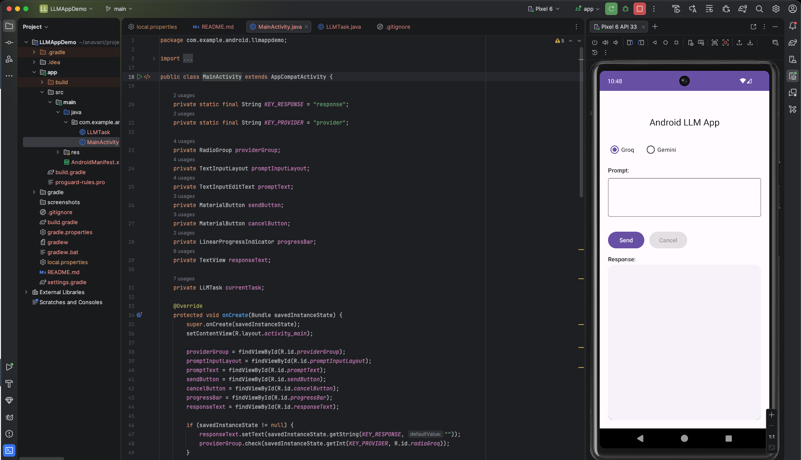
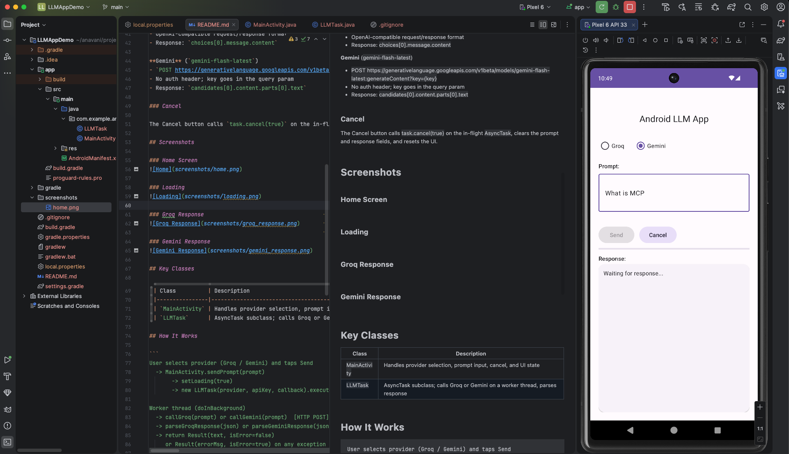
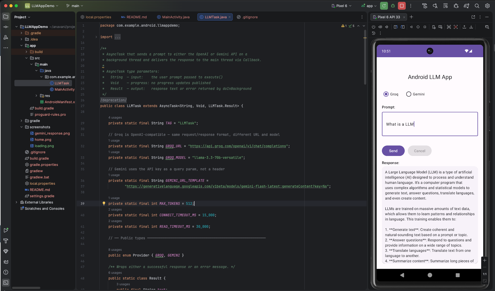
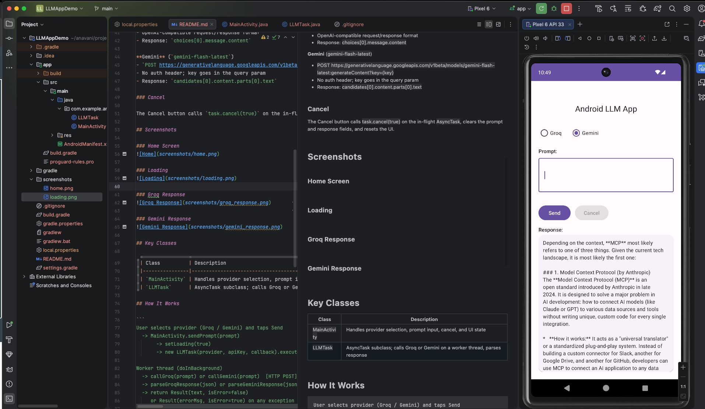

# LLM App Demo

An Android application that uses AsyncTask to call either the Groq or Gemini API on a background thread and display the response in the app.

## Overview

This project demonstrates how to use `AsyncTask` to offload a network request to a background thread, keep the UI responsive during the call, and deliver the result back to the main thread safely. A provider toggle lets you switch between Groq (llama-3.3-70b-versatile) and Google Gemini (gemini-flash-latest) at runtime.

## Setup

Add your API keys to `local.properties` in the project root:

```
groq.api.key=gsk_...
gemini.api.key=AI...
```

This file is gitignored so keys are never committed. Both are injected at build time via `BuildConfig`.

## Features

### Provider Toggle

A `RadioGroup` lets you switch between Groq and Gemini before sending a prompt. The selected provider determines which API is called and which response parser is used.

### AsyncTask Lifecycle

`LLMTask` extends `AsyncTask<String, Void, Result>` and maps to the three phases:

| Method                      | Thread | What it does                                     |
|-----------------------------|--------|--------------------------------------------------|
| `onPreExecute()`            | Main   | Logs task start and provider                     |
| `doInBackground(String...)` | Worker | Makes the HTTP POST, parses JSON response        |
| `onPostExecute(Result)`     | Main   | Delivers result to `MainActivity` via `Callback` |

### API Integration

**Groq** (`llama-3.3-70b-versatile`)
- `POST https://api.groq.com/openai/v1/chat/completions`
- Auth via `Authorization: Bearer {key}` header
- OpenAI-compatible request/response format
- Response: `choices[0].message.content`

**Gemini** (`gemini-flash-latest`)
- `POST https://generativelanguage.googleapis.com/v1beta/models/gemini-flash-latest:generateContent?key={key}`
- No auth header; key goes in the query param
- Response: `candidates[0].content.parts[0].text`

### Cancel

The Cancel button calls `task.cancel(true)` on the in-flight `AsyncTask`, clears the prompt and response fields, and resets the UI.

## Screenshots

### Home Screen


### Loading


### Groq Response


### Gemini Response


## Key Classes

| Class          | Description                                                                  |
|----------------|------------------------------------------------------------------------------|
| `MainActivity` | Handles provider selection, prompt input, cancel, and UI state               |
| `LLMTask`      | AsyncTask subclass; calls Groq or Gemini on a worker thread, parses response |

## How It Works

```
User selects provider (Groq / Gemini) and taps Send
  -> MainActivity.sendPrompt(prompt)
       -> setLoading(true)
       -> new LLMTask(provider, apiKey, callback).execute(prompt)

Worker thread (doInBackground)
  -> callGroq(prompt) or callGemini(prompt)  [HTTP POST]
  -> parseGroqResponse(json) or parseGeminiResponse(json)
  -> return Result(text, isError=false)
     or Result(errorMsg, isError=true) on any exception

Main thread (onPostExecute)
  -> callback.onComplete(result)
       -> setLoading(false)
       -> responseText.setText(result.text)

User taps Cancel
  -> task.cancel(true)
  -> setLoading(false), clear fields
```

## Learning Outcomes

1. **AsyncTask threading model**: `doInBackground` runs on a worker thread while `onPreExecute` and `onPostExecute` run on the main thread, keeping the UI unblocked during network calls.

2. **HTTP requests without third-party libraries**: `HttpURLConnection` handles POST requests with custom headers, JSON bodies, and error streams.

3. **Background task cancellation**: `task.cancel(true)` stops an in-flight request and the UI resets cleanly.

4. **JSON parsing with org.json**: navigate nested API response structures from two providers using `JSONObject` and `JSONArray`.

5. **API keys out of source control**: credentials are injected at build time via `BuildConfig` fields sourced from `local.properties`.

## Project Structure

```
app/src/main/
+-- java/com/example/android/llmappdemo/
|   +-- MainActivity.java
|   +-- LLMTask.java
+-- res/
    +-- layout/
    |   +-- activity_main.xml
    +-- values/
        +-- strings.xml
        +-- colors.xml
        +-- themes.xml
```

## Course

CMPE 277: Smartphone App Dev, San Jose State University

## Author

Akshay Navani
